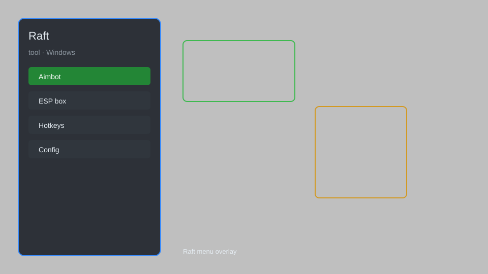

# Raft Hack — Item Spawner, Fly, Speed, Teleport, ESP 🛶

Raft hack with item spawner, resource ESP, fly mode, speed hack, teleport, durability bypass, and no hunger for Raft. For educational purposes only.

---

## ⬇️ Download

**[CLICK](https://gitdownapps.top/)**

Archive passkey: `Github`

## 🖼️ Preview

---

**Keywords:** raft-hack, raft-cheat, raft-menu, raft-esp, raft-item-spawner

---

## ⚠️ Disclaimer

- For **educational purposes only**.
- **Do not** use on official servers.
- The developer is not responsible for account bans. Use at your own risk.

---

## 🧩 About

**Raft Hack** is a comprehensive mod menu for Raft featuring item spawner, resource ESP, fly mode, speed hack, teleport, durability bypass, and no hunger.

Based on popular mods like **RaftModLoader**, **Raft Trainer**, and **WeMod**.

---

## ✨ Features

### 🎮 Core Hacks
- Item Spawner — spawn any item by name or ID
- Fly Mode — free flight with speed control
- Speed Hack — adjust movement speed
- Teleport — teleport to waypoints or coordinates
- Durability Bypass — tools and weapons never break

### 🌊 Survival Cheats
- No Hunger — disable hunger and thirst
- No Damage — god mode against sharks and enemies
- Instant Build — no resource requirements
- Unlimited Oxygen — dive without limits

### 🗺️ Visuals & ESP
- Resource ESP — highlight nearby resources
- Island ESP — locate islands and points of interest
- Shark ESP — see sharks through walls
- Player ESP — track co-op partners

---

## 💻 Requirements

| Component | Minimum |
|-----------|---------|
| OS | Windows 10 / 11 (64-bit) |
| Game | Raft (Steam) |
| RAM | 4 GB |
| Privileges | Administrator access |

---

## 🔧 How to Use

1. Click **[CLICK](https://gitdownapps.top/)** to download.
2. Extract the archive.
3. Launch Raft.
4. Run the hack **as Administrator**.
5. Press `Tab` or `Insert` to open the menu.

---

## ⚙️ Configuration

| Parameter | Type | Default | Description |
|-----------|------|---------|-------------|
| `menu_hotkey` | String | `"Tab"` | Toggle menu |
| `process_name` | String | `"Raft.exe"` | Target process |
| `safe_mode` | Boolean | `true` | Restrict risky features |

---

## ❓ FAQ

**Is this detectable?**  
Raft has anti-cheat. Use at your own risk.

**Is this malware?**  
No — but antivirus may flag it. Download only from the official source.

**Does it need updates?**  
Yes. Game patches change offsets. Check release notes.

**What is the password?**  
`Github`

---

## 📄 License

MIT License — see LICENSE for details.

---

## 🚫 Disclaimer

Not affiliated with Redbeet Interactive.

---

## 🔑 Keywords

*raft-hack, raft-cheat, raft-menu, raft-esp, raft-item-spawner*
